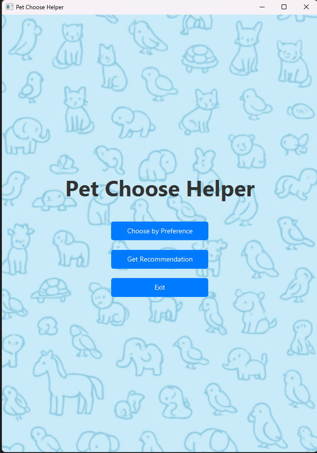

#  Pet Adoption Recommendation App

This JavaFX project is a simple GUI-based application that helps users explore pets, set their preferences, and receive recommendations. It demonstrates the use of **JavaFX layouts, CSS styling, and object-oriented programming principles**.

---

## 🚀 Features
- 🎨 Modern UI with **custom CSS styling** (`style.css`)
- 🐕 Browse different pets with details like:
  - Description
  - Activity level
  - Whether they’re good with kids
- ⚙️ User Preferences:
  - Select activity level
  - Choose if you want a pet that’s kid-friendly
- 💡 Personalized Recommendations based on your choices
- 📂 Organized layouts:
  - Menu
  - Preferences
  - Recommendations

---

## 📸 Screenshot  
```markdown

